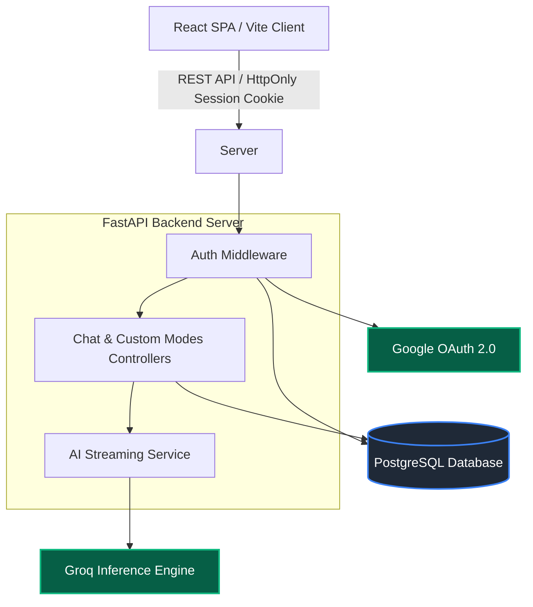

<div align="center">
  <h1>🧠 Tobi</h1>
  <p><em>One AI. Many minds. Your personalized, premium AI assistant platform.</em></p>

  [](https://tobi-gcbt.onrender.com)
  [](https://www.python.org/)
  [](https://reactjs.org/)
  [](LICENSE)
  [](.github/workflows/ci.yml)
</div>

---

## ✨ Features

- **Specialist Modes:** Access 28 built-in AI persona modes (Coding, Study, Research, etc.) or create your own custom instructions!
- **Lightning Fast Inference:** Powered by Groq for ultra-low latency AI streaming and rendering.
- **Circuit Breaker Architecture:** Intelligent failovers, exponential backoffs, and stream validation to handle transient API failures seamlessly.
- **Secure Authentication:** Passwordless Google OAuth 2.0 integration with secure `HttpOnly` sessions.
- **Responsive UI:** A stunning React frontend utilizing Vite and CSS variables for a fluid chat experience.

---

## 🛠️ Tech Stack

| Domain | Technology |
| :--- | :--- |
| **Frontend** | React 18, Vite, React Router DOM, Custom CSS |
| **Backend** | Python 3.11, FastAPI, SQLAlchemy, Alembic |
| **Authentication** | Google OAuth2 (`google-auth`), Secure HttpOnly Cookies |
| **Database** | PostgreSQL (`psycopg`), SQLite (Local) |
| **AI Inference** | Groq Cloud APIs (`llama-3.1-8b-instant`) |

---

## 🏗️ Architecture



---

## 📂 Folder Tree

```text
tobi/
├── app/                         # FastAPI Python Backend
│   ├── ai_service.py            # Circuit-breaking Groq AI stream logic
│   ├── auth.py                  # OAuth and session management
│   ├── config.py                # Environment pydantic settings
│   ├── database.py              # SQLAlchemy engine configuration
│   ├── main.py                  # API endpoints and middleware
│   ├── models.py                # SQLAlchemy ORM definitions
│   └── modes.py                 # Core AI specialist modes map
│
├── alembic/                     # Database Migrations
├── src/                         # React Frontend (Vite)
│   ├── api.js                   # API Fetch Wrappers and SSE Streamer
│   ├── App.jsx                  # React Component Tree
│   ├── index.css                # Scoped UI styles
│   └── main.jsx                 # React DOM Root
│
├── tests/                       # Pytest Test Suites
├── .github/workflows/           # CI/CD Pipelines
├── requirements.txt             # Pinned Python Dependencies
├── package.json                 # Node/Vite Dependencies
├── render.yaml                  # Render deployment configuration
├── alembic.ini                  # Alembic CLI configuration
└── .env.example                 # Environment variables template
```

---

## 📸 Screenshots

*(Add actual screenshots in `docs/screenshots/`)*


*The mode selector where you can pick your AI persona.*


*Lightning-fast response generation using Groq APIs.*

---

## 🚀 Local Setup

### Prerequisites
- Python 3.11+
- Node.js v20.0+
- Google OAuth Client ID
- Groq API Key

### Installation

1. **Clone the repository:**
   ```bash
   git clone https://github.com/chetanaybuilder/tobi.git
   cd tobi
   ```

2. **Configure Environment:**
   Copy `.env.example` to `.env` and fill in your credentials.

3. **Install Dependencies:**
   ```bash
   npm install
   python -m venv .venv
   source .venv/bin/activate  # On Windows: .venv\Scripts\activate
   pip install -r requirements.txt
   ```

4. **Initialize Database:**
   ```bash
   alembic upgrade head
   ```

5. **Run Development Servers:**
   - Run the frontend (Port 5173): `npm run dev`
   - Run the backend (Port 10000): `uvicorn app.main:app --reload --port 10000`

---

## 🔒 Environment Variables Reference

| Variable | Description |
| :--- | :--- |
| `DATABASE_URL` | SQLAlchemy connection string (PostgreSQL or SQLite) |
| `GROQ_API_KEY` | Key for Groq Inference API |
| `GROQ_MODEL` | Default inference model (e.g., `llama-3.1-8b-instant`) |
| `GOOGLE_CLIENT_ID` | OAuth2 Client ID from Google Cloud Console |
| `GOOGLE_CLIENT_SECRET` | OAuth2 Client Secret |
| `SESSION_SECRET` | Secure cryptographic signing key for sessions |
| `FRONTEND_URL` | Application URL (used for CORS restrictions) |

---

## 🌐 API Endpoint Reference

| Method | Endpoint | Authenticated | Description |
| :--- | :--- | :---: | :--- |
| `GET` | `/api/health` | ❌ | Health liveness probe |
| `POST`| `/api/auth/google` | ❌ | Validates Google ID tokens and creates sessions |
| `GET` | `/api/auth/me` | ✅ | Returns the current user profile and preferences |
| `POST`| `/api/chat/stream` | ✅ | Server-Sent Events (SSE) AI inference stream |
| `GET` | `/api/conversations` | ✅ | Fetch historical chats (paginated) |
| `GET` | `/api/modes` | ✅ | Fetches all supported core and custom AI modes |

---

## 🗺️ Roadmap & Contributing

Please refer to [CONTRIBUTING.md](CONTRIBUTING.md) and [SECURITY.md](SECURITY.md) for detailed policies before opening a pull request.

- [ ] Add image generation mode (DALL-E / Stable Diffusion).
- [ ] Incorporate vector database for context retrieval (RAG).

---

**Author:** [chetanaybuilder](https://github.com/chetanaybuilder)
